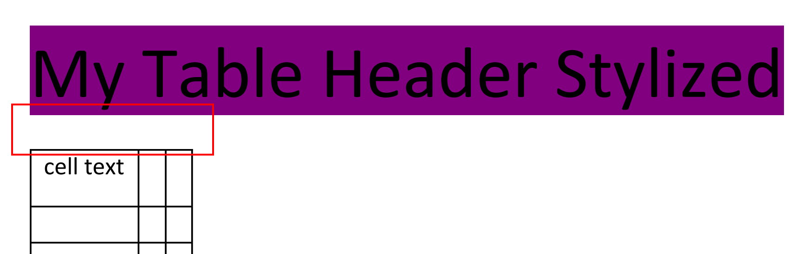
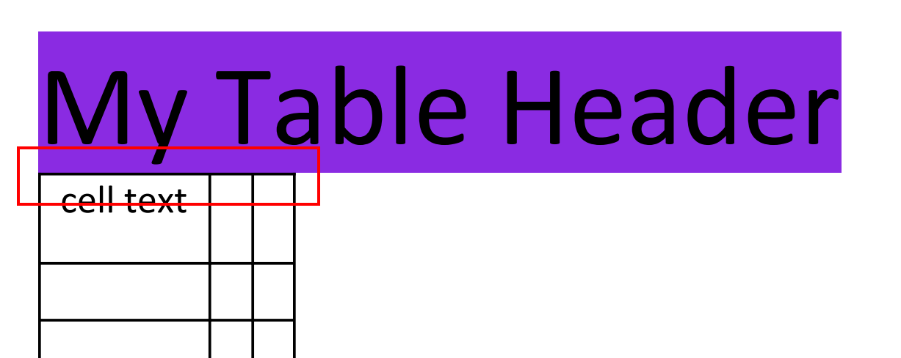
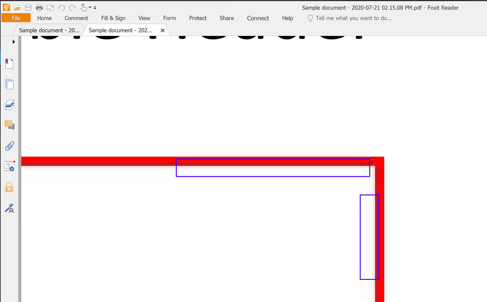
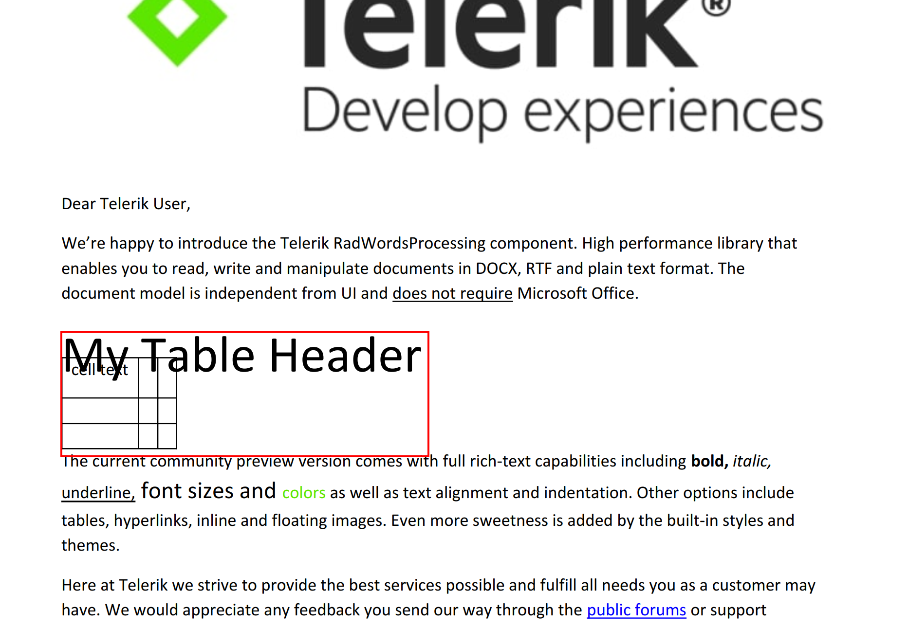
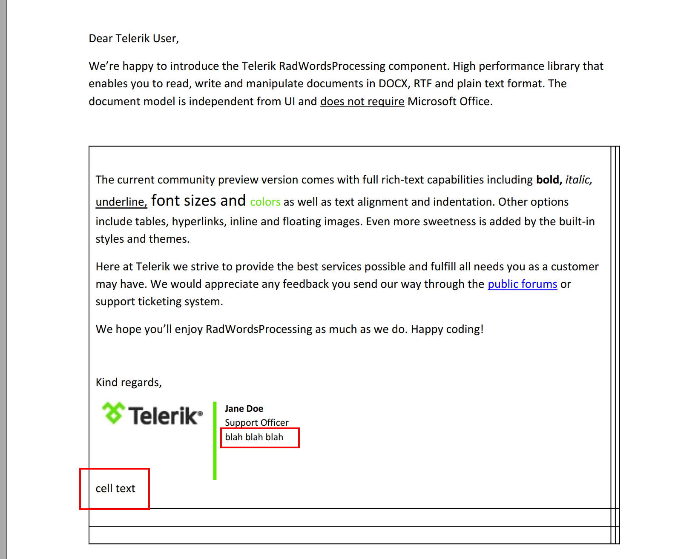

## Generate Document ##

### Style a run problem

Using a stlye ❌

Manually styled ✅

### Anti-aliasing problem

see around the red border (I draw a blue box to try to highlight it)

Same `bitmap` written to disk as an JPEG:

### Text on top of table problem

### Table position problem
